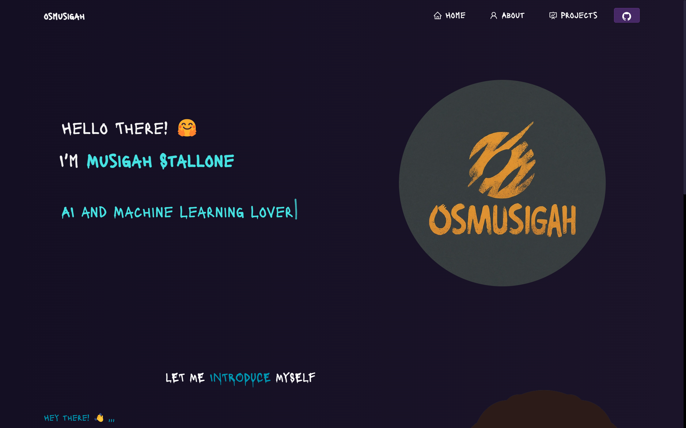

<h2 align="center">
  Portfolio Website - v2.0 
</h2>

  

 

## Built With

This project was built using these technologies.

- React.js
- Node.js
- Express.js
- CSS3
- VsCode
- Vercel

## Getting Started

Clone down this repository. You will need `node.js` and `git` installed globally on your machine.

## 🛠 Installation and Setup Instructions

1. Installation: `npm install`

2. In the project directory, you can run: `npm start`

## Usage Instructions

Open the project folder and Navigate to `/src/components/`.  
You will find all the components used and you can edit your information accordingly.

## Deployment
Link to website: *https://musigahstallone.vercel.app/*
